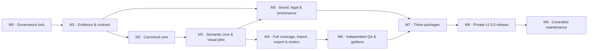

# Roadmap — Thien-Skill-Creative-Diagram v1.0.0

File này chỉ mô tả **thứ tự milestone và kết quả cấp cao**. Trạng thái có thẩm quyền và checklist nằm duy nhất trong `PLAN.md`; điều kiện pass/fail nằm trong `PHASE-GATES.md`.

## Luồng milestone

## Milestone map

| Milestone | Phase trong `PLAN.md` | Kết quả cấp cao | Gate chính |
|---|---|---|---|
| M0 — Governance lock | P-00 | Nguồn sự thật, kế hoạch và quy tắc vận hành được khóa; chưa triển khai. | G-00 |
| M1 — Evidence & contract | P-01 đến P-02 | Snapshot, provenance, taxonomy, product contract, design contract và test contract được duyệt. | G-01, G-02 |
| M2 — Canonical core | P-03 đến P-04 | Một skill core provider-neutral có router và IR rõ ràng. | Đóng góp G-03 |
| M3 — Semantic core & visual pilot | P-05 đến P-06 | Đủ semantic contract/grammar; visual system nguyên bản được chứng minh bằng pilot và golden direction. | G-03 |
| M4 — Full coverage, import, export & motion | P-07 đến P-08 | Visual coverage đạt toàn bộ inventory; input pipeline, safe import, portable output và static-first motion hoàn chỉnh. | G-04 |
| M5 — Brand, legal & provenance | P-09 đến P-10 | Logo derivative được duyệt; license/provenance candidate sẵn sàng cho luật sư. | G-06 |
| M6 — Independent QA & goldens | P-11 đến P-12 | Benchmark E2, hard checks, goldens và forward tests đạt yêu cầu. | G-04 |
| M7 — Three packages | P-13 | Claude, OpenAI/ChatGPT và Universal được build xác định từ cùng source. | G-05 |
| M8 — Private v1.0.0 release | P-14 | Chủ sở hữu xác nhận đủ approval/evidence, duyệt release candidate và ra lệnh push private repo. | G-07 |
| M9 — Controlled maintenance | P-15 | Ngoài completion scope v1.0.0; mỗi update lặp các gate bị ảnh hưởng. | Lặp G-01–G-07 theo release |

## Nguyên tắc tiến tuyến

- Không đi tiếp chỉ vì phase trước “gần xong”; phải có evidence và gate record.
- Có thể làm song song các workstream độc lập khi `PLAN.md` cho phép, nhưng không vượt gate phụ thuộc.
- Không rút ngắn QA, provenance hoặc legal gate để đạt mốc release.
- Mọi thay đổi phạm vi phải quay lại `PROJECT-CONTRACT.md` trước khi cập nhật roadmap.

**Current authoritative status:** xem `PLAN.md`.
