# Roadmap — Thien-Skill-Creative-Diagram v1.0.0 baseline / v2.0.0 released

File này chỉ mô tả **thứ tự milestone và kết quả cấp cao**. Trạng thái có thẩm quyền và checklist nằm duy nhất trong `PLAN.md`; điều kiện pass/fail nằm trong `PHASE-GATES.md`.

## Luồng milestone

```mermaid
flowchart LR
    M0["M0 · Governance lock"] --> M1["M1 · Evidence & contract"]
    M1 --> M2["M2 · Canonical core"]
    M2 --> M3["M3 · Semantic core & visual pilot"]
    M3 --> M4["M4 · Full coverage, import, export & motion"]
    M4 --> M6["M6 · Independent QA & goldens"]
    M1 --> M5["M5 · Brand, legal & provenance"]
    M3 --> M5
    M5 --> M7["M7 · Three packages"]
    M6 --> M7
    M7 --> M8["M8 · Private v1.0.0 release"]
    M8 --> M9["M9 · Controlled maintenance"]
    M9 --> M10["M10 · v1.5 upstream delta & contract"]
    M10 --> M11["M11 · 39-type semantic source"]
    M11 --> M12["M12 · Visual vNext pilot gallery"]
    M12 --> M13["M13 · Full 39-type source/gallery"]
    M13 --> M14["M14 · v2.0.0 package/release candidate"]
    M14 --> M15["M15 · Private v2.0.0 release"]
```

## Milestone map

| Milestone | Phase trong `PLAN.md` | Kết quả cấp cao | Gate chính |
|---|---|---|---|
| M0 — Governance lock | P-00 | Nguồn sự thật, kế hoạch và quy tắc vận hành được khóa; chưa triển khai. | G-00 |
| M1 — Evidence & contract | P-01 đến P-02 | Snapshot, provenance, taxonomy, product contract, design contract và test contract được duyệt. | G-01, G-02 |
| M2 — Canonical core | P-03 đến P-04 | Một skill core provider-neutral có router và IR rõ ràng. | Đóng góp G-03 |
| M3 — Semantic core & visual pilot | P-05 đến P-06 | Đủ semantic contract/grammar; visual system nguyên bản được chứng minh bằng pilot và golden direction. | G-03 |
| M4 — Full coverage, import, export & motion | P-07 đến P-08 | Visual coverage đạt toàn bộ inventory; input pipeline, safe import, portable output và static-first motion hoàn chỉnh. | G-04 |
| M5 — Brand, legal & provenance | P-09 đến P-10 | Logo derivative được duyệt; license/provenance candidate sẵn sàng cho luật sư. | G-06 |
| M6 — Independent QA & goldens | P-11 đến P-12 | Benchmark E2, hard checks, goldens và forward tests đạt yêu cầu. | G-04 |
| M7 — Three packages | P-13 | Claude, OpenAI/ChatGPT và Universal được build xác định từ cùng source. | G-05 |
| M8 — Private v1.0.0 release | P-14 | Chủ sở hữu xác nhận đủ approval/evidence, duyệt release candidate và ra lệnh push private repo. | G-07 |
| M9 — Controlled maintenance | P-15 | Ngoài completion scope v1.0.0; mỗi update lặp các gate bị ảnh hưởng. | Lặp G-01–G-07 theo release |
| M10 — v1.5 upstream delta & contract | P-16 | Exact upstream snapshot, delta 27→39, bốn capability và source/gallery contract đã được owner duyệt; P-16 đóng theo D-047. | G-01@1.5.0, G-02@1.5.0 PASS |
| M11 — 39-type semantic source | P-17 | Canonical source/router/IR/grammar/test đã triển khai contract G-02 cho 39 type và bốn capability mới; P-17 đã đóng theo D-048. | Đóng góp G-04@1.5.0 |
| M12 — Visual vNext foundation & pilot | P-18R4→P-18R6 | Relock contract/foundation, chứng minh canonical kernel bằng Swimlane anchor rồi một `neutral-light` anchor cho đủ 14 layout engine; owner duyệt exact candidate trước khi nhân rộng. | G-03@1.5.0 |
| M13 — Full 39-type source/gallery | P-19A→P-19C | P-19B review-45 và P-19C review-01 đã owner-approved; P-18/P-19 giữ riêng, đúng 14 + 93 = 107, không substitution. D-128 khóa sample-not-fixed/user-request flexibility; M13/P-19 đóng và `G-04@1.5.0 PASS` theo D-129. | G-04@1.5.0 PASS |
| M14 — v2.0.0 package/release preparation | P-20 | Exact legal/brand, ba deterministic package và `TCD-RELEASE-2.0.0-RC1` đã owner-approved theo D-131; owner miễn independent lawyer review cho exact G-06 và chấp nhận rủi ro. Execution hold giữ historical dist/publication/Git/Release không đổi. | G-00…G-07@2.0.0 PASS |
| M15 — Private v2.0.0 release | P-21 | Hoàn tất theo D-133: private non-draft/non-prerelease Release, exact commit/tag/asset digest verified; v1.0.0 giữ nguyên. | G-07@2.0.0 execution PASS |

## Nguyên tắc tiến tuyến

- Không đi tiếp chỉ vì phase trước “gần xong”; phải có evidence và gate record.
- Có thể làm song song các workstream độc lập khi `PLAN.md` cho phép, nhưng không vượt gate phụ thuộc.
- Không rút ngắn QA, provenance hoặc legal gate để đạt mốc release.
- Mọi thay đổi phạm vi phải quay lại `PROJECT-CONTRACT.md` trước khi cập nhật roadmap.
- M10/P-16, M11/P-17, M12/P-18 và M13/P-19 đã hoàn tất. Exact P-18R6 review-17 giữ `G-03@1.5.0 PASS`; P-19B review-45 và P-19C review-01 đã owner-approved theo D-126/D-128; `G-04@1.5.0 PASS` theo D-129 với hard constraint 14 P-18 + 93 P-19 và sample-not-fixed flexibility.
- M14/P-20 đã hoàn tất và toàn bộ gate v2 `PASS` theo D-131 cho exact `TCD-RELEASE-2.0.0-RC1`; execution hold lịch sử đã được D-132 gỡ đúng một lần cho P-21.
- M15/P-21 đã hoàn tất theo D-133. Release `v2.0.0` là private, exact tag/commit/assets đã được đối chiếu; không có maintenance/release mutation tiếp theo nếu chưa có authorization mới.

**Current authoritative status:** xem `PLAN.md`.
